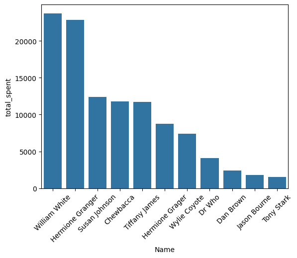

# P6 Customer Total Revenue Analysis

This is a separate readme file just for the P6 project as I have had many issues with projects during this course. To ease confusion and for clarity it was best to create a separate readme document just for this project.

## Section 1 - Business Goal
- Calculate the total revenue generated by each customer. This is important as overall sales can then lead to drilling down into why those sales are being driven and future sales goals. possibly targeting future customers, products, or locations.

## Section 2 - Data Source
- I performed this analysis based on macOS and have had multiple issues with data warehousing and programs which we have been using for this course
- Because of this I used the prepared CSV data and convered that through cubing in order to get the information I wanted
- Part of the reason I went through these steps is if I wanted to further extrapulate data after cubing I could get more information
- The two tables of data used were customers and sales data
- Within those two tables the columns used were customerid, saledate, sale amount, and name

## Section 3 - Tools
- Tools used were Python and Spark
- I wanted to keep this simple as I have had many issues while attempting to do these projects as PowerBI appears to be the preffered tool for this class but I do not have a windows operating system to run

## Section 4 - Workflow and Logic
- Dimensions used were saledate, customerid, and saleamount
- Aggregations were not the focus but could be split into quarterly or monthly sales

## Section 5 - Results
- The goal was to see which customers were generating the top revenue
- The top 3 customers are William White, Hermione Granger, and Susan Johnson best illistrated in the bar chart below 

## Section 6 - Suggested Business Action
- There is a large difference between the top two customers and the rest which would suggest further study of just those customers
- Potential drivers of this are types of products or company size
- Also with the revenue numbers in the bar chart there are aso groupings where the revenue appears to be consistent
- The top two customers are similar then customers 3-5 are also very similar so this could also show trends that could lead to additional sales

## Section 7 - Challenges
- There were no specific challenges in this project as I kept everything very simple as I encountered so many problems previously
- In the future I really want to have an opportunity to use PowerBI as it appears to be much more user friendly and powerful than just using python and spark for this type of analysis